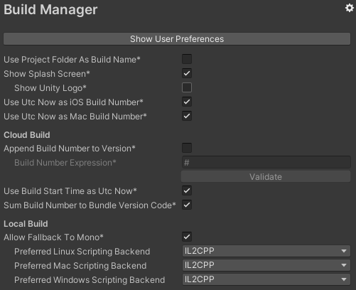
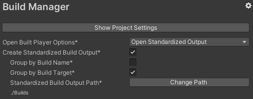

# About Build Management

Use the Build Management package to automatize some common actions when building your application. For example, use Build Management to auto increment your build number or to generate a build output with a standardized pattern. The Build Management package also comes integrated with the Unity Cloud Build workflow.

# Installing Build Management

To install this package, follow the instructions in the [Package Manager documentation](https://docs.unity3d.com/Packages/com.unity.package-manager-ui@latest/index.html). 

# Using Build Management

In the Build Management package there are settings that affects the project itself (`Edit/Project Settings.../Build Manager`):

> `*` Settings with tooltips.

And settings that can be individually set by each user locally (`Edit/Preferences.../Build Manager`):

> `*` Settings with tooltips.

Most options don't require any additional steps, the only exceptions are:

- Allow Fallback To Mono
- Create Standardized Build Output

Before start using those features you need to either:

- Call the `BuildManager` functions during your build pipeline
- Overriding your current build pipeline like demonstrated in the `Default Initializer` sample

# Technical details

## Requirements

This version of Build Management is compatible with the following versions of the Unity Editor:

* 2019.4 or later

## Document revision history

|Date|Comment|
|---|---|
|2020-08-02|Document created. Matches package version 1.0.0|
